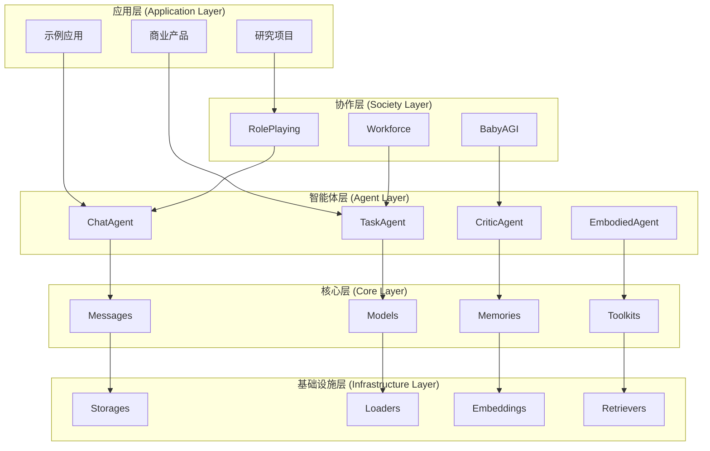
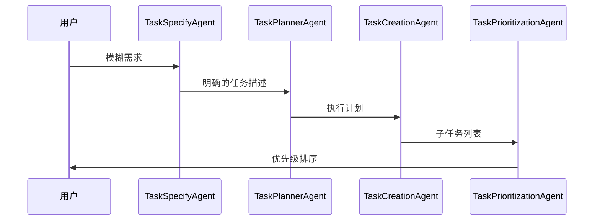
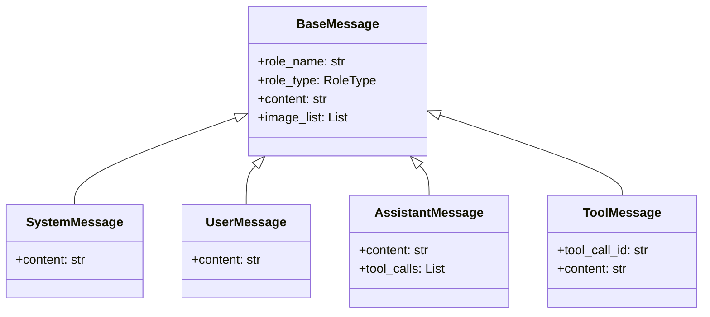
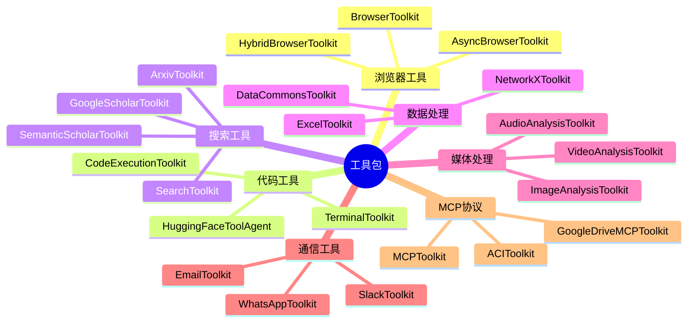
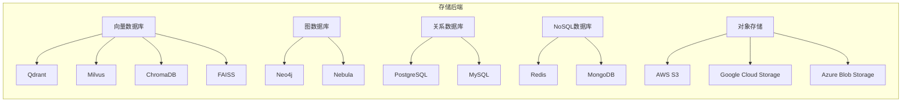

# CAMEL代码架构详解

## 架构总览

CAMEL（Communicative Agents for Mind Exploration and Learning）采用高度模块化的架构设计，每个模块职责明确，通过清晰的接口进行交互。整体架构分为以下几个层次：



## 核心模块详解

### 1. Agents模块（智能体核心）

#### 1.1 BaseAgent（基础智能体）

位置：`camel/agents/base.py`

```python
from abc import ABC, abstractmethod
from typing import Any

class BaseAgent(ABC):
    """所有智能体的基类，定义了核心接口"""

    @abstractmethod
    def reset(self, *args: Any, **kwargs: Any) -> Any:
        """重置智能体到初始状态"""
        pass

    @abstractmethod
    def step(self, *args: Any, **kwargs: Any) -> Any:
        """执行智能体的单步操作"""
        pass

    @property
    @abstractmethod
    def name(self) -> str:
        """智能体名称"""
        pass
```

**设计要点**：
- 使用抽象基类确保接口一致性
- 定义了reset和step两个核心方法
- 支持可扩展的状态管理

#### 1.2 ChatAgent（对话智能体）

位置：`camel/agents/chat_agent.py`

这是CAMEL框架中最核心的智能体实现，包含了23万+行代码，提供了丰富的对话功能。

**主要功能模块**：

```python
class ChatAgent(BaseAgent):
    def __init__(
        self,
        model: BaseModelBackend,
        tools: Optional[List[FunctionTool]] = None,
        memory: Optional[BaseMemory] = None,
        message_window_size: Optional[int] = None,
        ...
    ):
        """初始化对话智能体"""
        self.model = model
        self.tools = tools or []
        self.memory = memory
        self.message_window_size = message_window_size
        self.task_checker = task_checker
        # ... 更多配置参数

    def step(
        self,
        message: Optional[BaseMessage] = None,
        ...
    ) -> ChatAgentResponse:
        """执行对话步骤"""
        # 1. 处理输入消息
        # 2. 从记忆中检索相关上下文
        # 3. 调用工具（如果需要）
        # 4. 生成响应
        # 5. 更新记忆
        pass
```

**关键特性**：
- **多模态支持**：支持文本、图像、视频等多种消息类型
- **工具调用**：集成丰富的工具包，支持函数调用
- **记忆管理**：内置记忆系统，支持长期和短期记忆
- **流式响应**：支持流式输出，提升用户体验
- **任务检查**：内置任务完成检查机制

#### 1.3 TaskAgent系列（任务智能体）

位置：`camel/agents/task_agent.py`

```python
class TaskSpecifyAgent(ChatAgent):
    """任务指定智能体 - 明确任务需求"""

class TaskPlannerAgent(ChatAgent):
    """任务规划智能体 - 制定执行计划"""

class TaskCreationAgent(ChatAgent):
    """任务创建智能体 - 生成新任务"""

class TaskPrioritizationAgent(ChatAgent):
    """任务优先级智能体 - 确定任务优先级"""
```

**协作流程**：


### 2. Messages模块（消息系统）

#### 2.1 BaseMessage（基础消息）

位置：`camel/messages/base.py`

```python
from dataclasses import dataclass
from typing import List, Optional, Union, Any, Dict, Literal
from PIL import Image

@dataclass
class BaseMessage:
    """基础消息类，支持多模态内容"""
    role_name: str                    # 角色名称
    role_type: RoleType               # 角色类型：USER/ASSISTANT/CRITIC
    meta_dict: Optional[Dict[str, Any]] = None  # 元数据

    # 内容字段
    content: str = ""                 # 文本内容
    image_list: Optional[List[Union[Image.Image, str]]] = None  # 图片列表
    video_bytes: Optional[bytes] = None  # 视频内容

    # 配置字段
    image_detail: Literal["auto", "low", "high"] = "auto"  # 图片质量
    video_detail: Literal["auto", "low", "high"] = "auto"  # 视频质量

    # 解析和推理
    parsed: Optional[Union[BaseModel, dict]] = None       # 结构化解析
    reasoning_content: Optional[str] = None               # 推理过程
```

**设计特点**：
- **多模态支持**：统一处理文本、图像、视频
- **结构化解析**：支持将内容解析为结构化数据
- **推理过程记录**：记录模型的推理过程
- **灵活配置**：支持不同质量等级的多媒体内容

#### 2.2 消息类型体系



### 3. Models模块（模型管理）

#### 3.1 ModelFactory（模型工厂）

位置：`camel/models/model_factory.py`

```python
class ModelFactory:
    """模型工厂，统一管理不同平台的模型"""

    _MODEL_PLATFORM_TO_CLASS_MAP = {
        ModelPlatformType.OPENAI: OpenAIModel,
        ModelPlatformType.ANTHROPIC: AnthropicModel,
        ModelPlatformType.GEMINI: GeminiModel,
        ModelPlatformType.OLLAMA: OllamaModel,
        ModelPlatformType.AZURE: AzureOpenAIModel,
        ModelPlatformType.AWS_BEDROCK: AWSBedrockModel,
        ModelPlatformType.LITELLM: LiteLLMModel,
        # ... 支持40+种模型平台
    }

    @classmethod
    def create(
        cls,
        model_platform: ModelPlatformType,
        model_type: ModelType,
        model_config_dict: Optional[Dict[str, Any]] = None,
    ) -> BaseModelBackend:
        """创建模型实例"""
        model_class = cls._MODEL_PLATFORM_TO_CLASS_MAP[model_platform]
        return model_class(model_type, model_config_dict)
```

**支持的模型类型**：

1. **OpenAI系列**：GPT-3.5、GPT-4、GPT-4o、GPT-4o-mini等
2. **Anthropic系列**：Claude 3 Opus、Sonnet、Haiku等
3. **Google系列**：Gemini Pro、Gemini Ultra等
4. **开源模型**：Llama、Mistral、Qwen、DeepSeek等
5. **云服务**：Azure OpenAI、AWS Bedrock、Google Vertex AI等

#### 3.2 BaseModelBackend（基础模型后端）

```python
class BaseModelBackend(ABC):
    """模型后端基类"""

    @abstractmethod
    def run(
        self,
        messages: List[BaseMessage],
        ...
    ) -> ChatCompletionResponse:
        """运行模型推理"""
        pass

    @abstractmethod
    def run_stream(
        self,
        messages: List[BaseMessage],
        ...
    ) -> Iterator[ChatCompletionResponse]:
        """运行流式推理"""
        pass

    @abstractmethod
    def encode(self, text: str) -> List[int]:
        """文本编码"""
        pass

    @abstractmethod
    def decode(self, tokens: List[int]) -> str:
        """令牌解码"""
        pass
```

### 4. Toolkits模块（工具系统）

#### 4.1 BaseToolkit（基础工具包）

位置：`camel/toolkits/base.py`

```python
class BaseToolkit(metaclass=AgentOpsMeta):
    """工具包基类"""

    def get_tools(self) -> List[FunctionTool]:
        """获取工具列表"""
        raise NotImplementedError("子类必须实现此方法")

    def run_mcp_server(
        self,
        mode: Literal["stdio", "sse", "streamable-http"] = "stdio"
    ):
        """运行MCP服务器"""
        self.mcp.run(mode)
```

#### 4.2 FunctionTool（函数工具）

位置：`camel/toolkits/function_tool.py`

```python
class FunctionTool:
    """将Python函数转换为可调用的工具"""

    def __init__(
        self,
        func: Callable,
        name: Optional[str] = None,
        description: Optional[str] = None,
        json_schema: Optional[Dict[str, Any]] = None,
        ...
    ):
        self.func = func
        self.name = name or func.__name__
        self.description = description or func.__doc__
        self.json_schema = json_schema or self._generate_schema()

    def run(self, *args, **kwargs) -> Any:
        """执行工具函数"""
        # 类型检查
        # 参数验证
        # 超时控制
        # 错误处理
        return self.func(*args, **kwargs)
```

#### 4.3 主要工具包类别



### 5. Societies模块（智能体社会）

#### 5.1 RolePlaying（角色扮演）

位置：`camel/societies/role_playing.py`

```python
class RolePlaying:
    """角色扮演系统，支持多智能体协作"""

    def __init__(
        self,
        assistant_role_name: str,           # 助手角色
        user_role_name: str,                # 用户角色
        critic_role_name: str = "critic",   # 批评者角色
        task_prompt: str = "",              # 任务提示
        with_task_specify: bool = True,     # 是否指定任务
        with_task_planner: bool = False,    # 是否规划任务
        with_critic_in_the_loop: bool = False,  # 是否包含批评者
        lang_type: Optional[LangType] = None,  # 语言类型
        ...
    ):
        # 初始化各个智能体
        self.assistant_agent = ChatAgent(...)
        self.user_agent = ChatAgent(...)
        self.critic_agent = ChatAgent(...)
        self.task_specify_agent = TaskSpecifyAgent()

        # 配置角色提示词
        self.setup_role_prompts()

    def run(self) -> Iterator[BaseMessage]:
        """运行角色扮演对话"""
        # 1. 指定任务（可选）
        # 2. 规划任务（可选）
        # 3. 开始对话循环
        # 4. 批评者反馈（可选）
        pass
```

#### 5.2 Workforce（工作力）

位置：`camel/societies/workforce/`

```python
class Workforce:
    """工作力系统，协调多个专业智能体"""

    def __init__(
        self,
        agents: List[BaseAgent],
        task_queue: Optional[Queue] = None,
        ...
    ):
        self.agents = agents
        self.task_queue = task_queue
        self.task_assigner = TaskAssigner()
        self.result_aggregator = ResultAggregator()

    def execute_workflow(
        self,
        tasks: List[Task]
    ) -> List[TaskResult]:
        """执行工作流"""
        # 1. 任务分解
        # 2. 任务分配
        # 3. 并行执行
        # 4. 结果聚合
        pass
```

### 6. Memories模块（记忆系统）

#### 6.1 MemoryBlock（记忆块）

位置：`camel/memories/memory_block.py`

```python
class MemoryBlock(ABC):
    """记忆块基类"""

    @abstractmethod
    def write_records(self, records: List[MemoryRecord]) -> None:
        """写入记忆记录"""
        pass

    @abstractmethod
    def read_records(
        self,
        limit: Optional[int] = None,
        filter_func: Optional[Callable] = None
    ) -> List[MemoryRecord]:
        """读取记忆记录"""
        pass

    @abstractmethod
    def clear(self) -> None:
        """清空记忆"""
        pass

class MemoryRecord:
    """记忆记录"""
    timestamp: datetime
    content: str
    metadata: Dict[str, Any]
    importance: float
    tags: List[str]
```

#### 6.2 记忆类型

1. **ChatHistoryMemory**：聊天历史记忆
2. **AgentMemory**：智能体专属记忆
3. **ContextMemory**：上下文记忆
4. **EpisodicMemory**：情景记忆
5. **SemanticMemory**：语义记忆

### 7. Storages模块（存储系统）

#### 7.1 存储后端支持



## 设计模式应用

### 1. 工厂模式（Factory Pattern）

**应用场景**：模型创建、工具包创建

```python
# 模型工厂
ModelFactory.create(
    model_platform=ModelPlatformType.OPENAI,
    model_type=ModelType.GPT_4O
)

# 工具包工厂
ToolkitFactory.create_toolkit(toolkit_type="search")
```

### 2. 策略模式（Strategy Pattern）

**应用场景**：不同智能体的行为策略

```python
class BaseAgent:
    def step(self, message):
        # 根据不同的策略执行
        return self.strategy.execute(message)

class ChatStrategy:
    def execute(self, message):
        # 对话策略实现
        pass

class TaskStrategy:
    def execute(self, message):
        # 任务策略实现
        pass
```

### 3. 观察者模式（Observer Pattern）

**应用场景**：消息系统、事件处理

```python
class MessageEvent:
    def __init__(self, message):
        self.message = message
        self.observers = []

    def attach(self, observer):
        self.observers.append(observer)

    def notify(self):
        for observer in self.observers:
            observer.update(self.message)
```

### 4. 装饰器模式（Decorator Pattern）

**应用场景**：工具功能增强、记忆管理

```python
@with_timeout(30)  # 添加超时控制
def search_tool(self, query):
    return self.search_engine.search(query)

@memory_enabled  # 添加记忆功能
class ChatAgent(BaseAgent):
    pass
```

## 关键技术特性

### 1. 异步编程

CAMEL大量使用异步编程模式，支持并发处理：

```python
async def step_async(self, message):
    # 异步工具调用
    tool_results = await asyncio.gather(*[
        tool.run_async(message)
        for tool in self.tools
    ])

    # 异步模型调用
    response = await self.model.run_async(messages)

    return response
```

### 2. 流式处理

支持流式响应，提升用户体验：

```python
async def stream_response(self, message):
    async for chunk in self.model.run_stream(messages):
        yield chunk
```

### 3. 类型安全

使用类型注解和Pydantic确保类型安全：

```python
from typing import List, Optional, Dict, Any
from pydantic import BaseModel

class AgentConfig(BaseModel):
    name: str
    model_type: ModelType
    tools: List[FunctionTool] = []
    memory: Optional[BaseMemory] = None
```

### 4. 错误处理

完善的错误处理机制：

```python
class CAMELException(Exception):
    """CAMEL框架基础异常"""
    pass

class ModelError(CAMELException):
    """模型相关错误"""
    pass

class ToolError(CAMELException):
    """工具执行错误"""
    pass
```

## 性能优化

### 1. 内存管理

- **记忆压缩**：自动压缩和总结历史对话
- **缓存机制**：智能缓存模型响应和工具结果
- **惰性加载**：按需加载模块和数据

### 2. 并发优化

- **连接池**：复用HTTP连接
- **批处理**：批量处理多个请求
- **异步I/O**：非阻塞I/O操作

### 3. 资源调度

- **模型池**：管理多个模型实例
- **任务队列**：平衡任务负载
- **资源监控**：实时监控资源使用

## 扩展机制

### 1. 智能体扩展

```python
class CustomAgent(BaseAgent):
    """自定义智能体"""

    def __init__(self, custom_config):
        super().__init__()
        self.custom_config = custom_config

    def step(self, message):
        # 自定义行为逻辑
        pass
```

### 2. 工具扩展

```python
class CustomToolkit(BaseToolkit):
    """自定义工具包"""

    def get_tools(self):
        return [
            FunctionTool(self.custom_function),
            FunctionTool(self.another_function)
        ]

    def custom_function(self, arg1, arg2):
        # 工具实现
        pass
```

### 3. 模型扩展

```python
class CustomModel(BaseModelBackend):
    """自定义模型后端"""

    def run(self, messages):
        # 调用自定义模型API
        pass
```

## 最佳实践

### 1. 智能体设计

- **单一职责**：每个智能体专注特定任务
- **状态管理**：合理使用记忆系统
- **错误恢复**：实现错误处理和恢复机制

### 2. 工具开发

- **参数验证**：严格验证输入参数
- **错误处理**：提供清晰的错误信息
- **文档完善**：编写详细的工具文档

### 3. 性能优化

- **异步操作**：使用异步编程提升性能
- **资源复用**：复用连接和对象
- **监控调试**：使用日志和监控工具

## 总结

CAMEL框架展现了一个设计精良、功能强大的多智能体系统架构。其核心特点包括：

1. **模块化设计**：清晰的模块划分，易于维护和扩展
2. **丰富的生态**：支持多种模型和工具，满足不同需求
3. **强大的协作能力**：通过角色扮演和工作力实现复杂协作
4. **类型安全**：全面的类型注解和数据验证
5. **性能优化**：智能的内存管理和并发处理
6. **扩展性**：开放的架构支持自定义扩展

这种架构设计使得CAMEL能够胜任从简单的对话机器人到复杂的多智能体协作系统的各种应用场景，为AI研究和应用开发提供了坚实的基础。